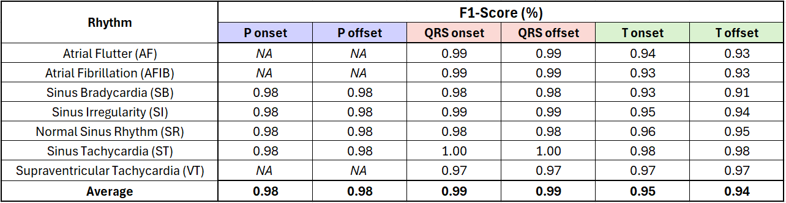
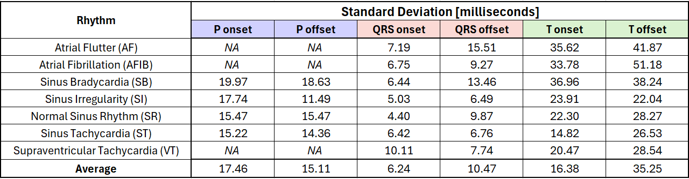
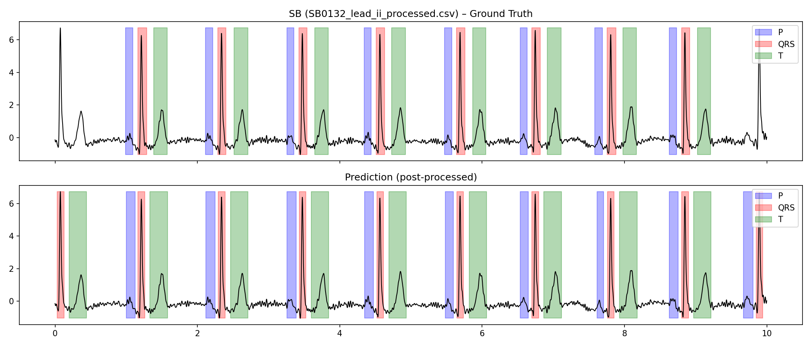
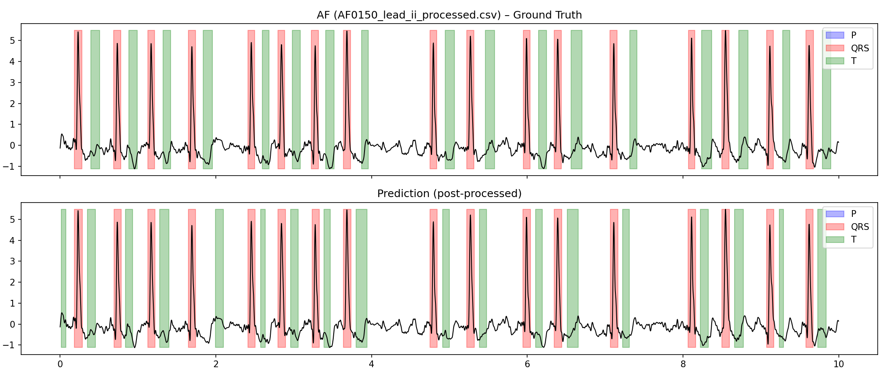

# ECG Delineation with Rhythm-Aware Deep Learning

This repository contains a deep learning pipeline for **automatic ECG delineation**, where the goal is to detect the onset and offset of P waves, QRS complexes, and T waves in single-lead ECG signals. The work is based on the **Resting ECG Segmentation Dataset (RDB, 2024)**, with additional modifications in preprocessing, modeling, and post-processing to improve accuracy and generalization across multiple arrhythmia types.

Dataset reference: [Resting ECG Segmentation Dataset (RDB) – figshare, 2024](https://figshare.com/articles/dataset/_b_Resting_ECG_Segmentation_Dataset_b_/28892186?file=54060602)

---

## Dataset

- The original dataset contains **2399 12-lead ECG recordings**, each 10 seconds long and sampled at 500 Hz (5000 samples per record).  
- In this project, **only Lead II** from each recording is used for training and evaluation.  
- Each recording has an accompanying annotation file specifying the onset and offset indices of P waves, QRS complexes, and T waves.  
- **Records used here:** 2278 recordings.  Atrial Tachycardia (AT) cases (121 recordings) were removed. 
- **Rhythms covered (7 types):**  
   - AF (Atrial Flutter): 400
   - AFIB (Atrial Fibrillation): 400
   - SB (Sinus Bradycardia): 400
   - SI (Sinus Irregularity): 399
   - SR (Sinus Rhythm): 400
   - ST (Sinus Tachycardia): 140
   - VT (Supraventricular Tachycardia): 139

### Notes on wave presence
- In this dataset, **AF and AFIB** signals do not contain annotations for P waves. 
- **VT** contains P waves in only a few cases (5 out of 139 records).

This aligns with physiological characteristics, as atrial flutter (AF) and atrial fibrillation (AFIB) involve disorganized or rapid atrial activity that replaces normal P waves with flutter or fibrillatory waves, while supraventricular tachycardia (VT) often has P waves that are buried within the QRS complex, retrograde, or otherwise challenging to detect and annotate.

This information is incorporated into the model design and evaluation, as explained below.

---

### Dataset Splits

The dataset was divided into **70% training, 15% validation, and 15% testing**.  
Splits were performed **stratified by rhythm type**, to ensure balanced representation of all rhythm classes across the splits and prevent bias toward more common rhythms.

---

## Preprocessing

Each ECG recording undergoes the following preprocessing steps before being used for training or evaluation:

1. **Band-pass filtering (0.5–40 Hz):**  
   Removes baseline wander (very low frequency drift) and power-line interference, preserving the clinically relevant frequency range of ECG signals.  

2. **Normalization:**  
   Signals are rescaled to a consistent amplitude range to stabilize training.  

These steps ensure that the model learns from clean and standardized signals, improving robustness to noise and amplitude variations.

---

## Model

The model extends the standard 1D U-Net design by incorporating **dense skip connections** across **multiple scales**. Instead of connecting only encoder and decoder layers at the same depth, each decoder block aggregates features from several encoder levels and, in some cases, from deeper decoder outputs. This richer fusion of multi-scale features allows the model to better capture both fine-grained wave boundaries and broader temporal context, which is important for delineating ECG signals with varying morphologies. 

### Rhythm-type conditioning
A key modification is the addition of **rhythm-type conditioning**:

- Each input ECG comes with a known rhythm label (e.g., AF, SB, ST).  
- This rhythm label is mapped to a learnable embedding vector.  
- The embedding is concatenated with the ECG signal as an additional input channel, providing context to the model.  

This mechanism allows the network to adapt its feature extraction depending on the rhythm type. For example, QRS morphology in AFIB looks different from SR, and P waves may be absent altogether.  

In addition to input conditioning, the training and evaluation procedures use rhythm-specific rules:
- For rhythms where P waves do not exist (AF, AFIB, VT), the loss function ignores the P class.  
- During evaluation, the model is explicitly prevented from predicting P waves for these rhythms by suppressing the logits for that class.  

This approach leverages clinically realistic prior knowledge. Instead of forcing the network to classify arrhythmias from scratch, it uses rhythm information as context, which is consistent with real-world scenarios where rhythm type is often already known.

---

## Training

- **Loss function:** Combination of Cross-Entropy (CE) loss and Dice loss, balancing pixel-level classification with overlap-based segmentation quality.  
- **Optimizer:** Adam.  
- **Learning rate scheduler:** Cosine annealing or plateau-based reduction (configurable).  
- **Batch size:** 32 (default).  
- **Epochs:** 100 (default).  
- **Checkpointing:** The best model checkpoint is chosen based on validation F1 score. Intermediate checkpoints are saved at fixed intervals.  
- **Logging:** Training loss and F1 scores are written to `train_log.csv`.  

---

## Post-processing

Model predictions are refined using domain-specific rules:

- Segments shorter than a physiologically plausible minimum length are removed.  
- At most one P wave and one T wave are retained around each QRS complex.  

This ensures that final delineations are physiologically realistic and reduces spurious detections.

---

## Evaluation

Evaluation is performed on the test set, with metrics calculated for each wave type (P, QRS, T), separately for onset and offset. Metrics are reported both per rhythm type and averaged across rhythms.

- **Metrics:**  
  - Sensitivity (Se)  
  - Positive Predictive Value (PPV)  
  - F1 score  
  - Mean and standard deviation of boundary timing errors (μ and σ, in milliseconds)  

### Important details:
- All reported metrics are **after post-processing**.  
- A predicted onset or offset is considered a **true positive** if it falls within a predefined temporal tolerance (in ms) of the ground truth annotation.  

### Results summary:
- **F1 > 0.98** for P-wave and QRS onsets/offsets across all rhythm types.  
- **F1 > 0.93** for T-wave onsets/offsets.  
- **Average σ ≈ 19 ms** across rhythms and wave types, showing high timing precision.  

---

## Repository Structure

```text
src/
├─ CONFIG.py       # argument parsing, dataset paths, rhythm definitions
├─ DATASET.py      # ECG dataset loader, annotation parsing
├─ MODEL.py        # 1D U-Net variant with rhythm conditioning
├─ TRAIN.py        # training loop with loss, optimizer, logging
├─ EVAL.py         # evaluation on test set, metric computation
├─ METRICS.py      # sensitivity, PPV, F1, timing error calculations
├─ POSTPROCESS.py  # cleanup rules for predictions
└─ UTILS.py        # helper functions (filters, parsing, etc.)
```
---

## Usage

1. Mount data and clone repository in Colab:
   ```python
   from google.colab import drive
   drive.mount('/content/drive')

   !git clone https://github.com/orizarchi369/NewECGProject.git
   %cd /content/NewECGProject/src

2. Adjust paths in CONFIG.py to your data directories.

3. Train the model:
    from TRAIN import train_model
    best_metric = train_model(args, splits)

4. Evaluate the model:
    from EVAL import evaluate_model
    evaluate_model(args, splits)

---

## Results

### Performance on the Test Set

F1-scores for onset and offset detection of P waves, QRS complexes, and T waves across seven rhythm types. 
Results show excellent performance: >0.98 for P/QRS delineation and >0.93 for T waves. 
“NA” appears for rhythms that lack P waves (AF, AFIB, VT).


Standard deviation of onset/offset timing errors in milliseconds across rhythm types. Results show high temporal precision, with average variability of ~17 ms for P waves, ~6 ms for QRS, and ~16–35 ms for T waves, demonstrating the model’s consistency across diverse arrhythmias.


### Example Visualizations

The figure below shows ground truth annotations (top) compared to model predictions (bottom) for a sample of Sinus Bradycardia. Note that the model correctly identified the first and last heartbeats. These correct predictions were not present in the annotations and therefore counted as a false positive, slightly lowering the reported F1 despite being clinically accurate.


The following figure shows the result for a sample of Atrial Flutter (AF). In AF, no discernible P waves are present. During training and evaluation, the model was conditioned not to predict P waves for AF, and the results confirm that this approach worked as intended.


---

## Summary

This project demonstrates that deep learning combined with rhythm-aware conditioning and domain-specific preprocessing and post-processing can achieve highly accurate ECG delineation across diverse arrhythmias in the RDB dataset.
